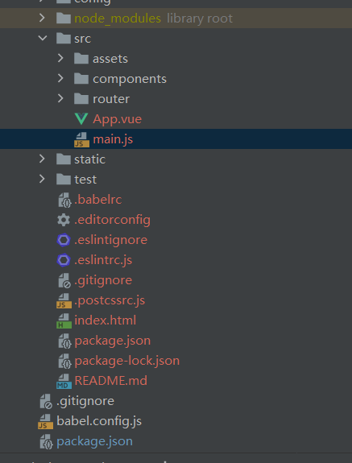

#12.24 工作日志

#地点：在家

##工作内容和进度

前端搭建和后端项目的环境搭建，及登录页面的实现.

前端搭建和后端搭建初步完成，登录页面没有实现。

##工作遇到的困难
idea构建的package.json 没有dev 通过vue init webpack vue_work添加dev 时，建立的是新文件夹（vue_work/vue_work），且只输入vue init webpack 会报错
进入创建的文件中，可以实现localhost：8080的打开，但是程序全是飘红

搭建element的时候 在vue_work文件夹下无法搭建但在前面建立的新文件夹下可以搭建，但搭建element最新版本无法在此文件夹下搭建。

##工作收获
对于前端搭建有一个初步的认识，对于搭建出现的大部分问题的解决方案都有了解。