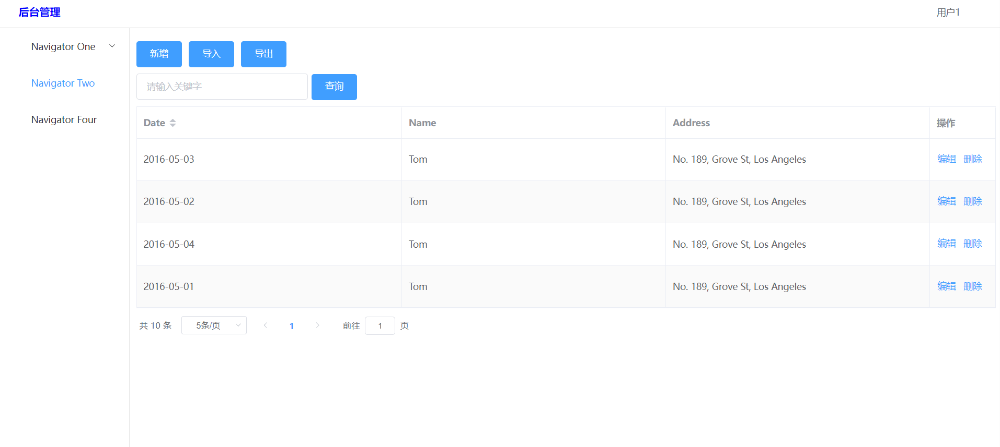

#12.24 工作日志

#地点：在家

##工作内容和进度

对于vue3.0的安装和对应vue3.0的element的安装
。
localhost：8080 成功展示

对于后端管理页面的初步编写

成果如下图

##工作遇到的困难
对于vue的idea配置的不了解，导致idea配置编译环境出错，对于element最新版的安装及安装步骤不熟悉，引发的不断重装element。目前看的教程里面讲的页面登录要求把

##工作收获
了解element的语句，初步了解vue，并且能够写出一个简单的后台管理页面。对于vue3.0的idea配置更加熟练